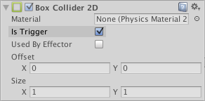

# Unity2DCheatsheet
A cheatsheet for Unity's 2D features. It's based on [this cheat sheet](http://cdn1.raywenderlich.com/wp-content/uploads/2014/11/UnityCheatsheet-0_1.pdf) but I've modified it for 2D.

I will rewrite it for my own games.

## Rotate the camera with the player
Position the camera inside the player hierarchy. Simple as that. Then it rotates with the player.


[Animation](animation.md)

## Non-physics movement

```
Transform.position = Vector2.Lerp(...)
Transform.translate(X, Y, Z)
```

## Physics 

### Rigidbodies
To make a GameObject under the control of the physics engine, add a ```Rigidbody2D```component.

With ```Rigidbodies2D``` do not attempt to move them by ```Transform``` properties (rotation, scale, position). Instead apply forces.

```
rigidBody = GetComponent<RigidBody2D>();
rigidBody.AddForce(force...);

```

or

```
rigidBody = GetComponent<RigidBody2D>();
rigidBody.velocity = new Vector2( x , y );
```

or

```
rigidBody = GetComponent<RigidBody2D>();
rigidBody.MovePosition(toNewPosition);
```

### Colliders


```C#
BoxCollider2D
CircleCollider2D
PolygonCollider2D
```

### Floors, walls, and other motionless elements
Add a collider to an object, but don't add a Rigidbody component.

### Collisions and Triggers

Normally colliders **collide** with other colliders, which means they apply force to each other.

Triggers do not apply forces. They are good to use when you want a character to move over an area (a "trigger") without boucing off of it or being blocked by it.

To make something a trigger in the Editor, check the "isTrigger" checkbox.




```C#
OnCollisionEnter2D
OnCollisionExit2D
OnCollisionStay2D

```


### Triggers

```C#
OnTriggerEnter2D
OnTriggerExit2D
OnTriggerStay2D

```

### Destroy

Removes a game object, component or asset

```C#
Destroy (myObject);
```

### Spawn (instantiate)

```C#
Instantiate(gameObject, position, Quaternion.identity)A as GameObject;
```

## GameObject Events

###Update()
Called once per frame.

###FixedUpdate()
Called multiple times per frame.
Should be used when applying forces or other physics related functions.

### LastUpdate()
Called  once  per frame after Update()  has finished. 
Good  for camera  movement.

#### How to crash unity: Use a ```loop``` (for, while) inside of Update(), FixedUpdate(), or LastUpdate().


##Input

### Conventional

```C#
Input.GetAxis("Horizontal")
Input.GetAxis("Vertical")
```

### Mobile

Mobile uses an Input.Touch data structure.

Useful properties include ```position``` and ```deltaPosition``` (change in position since the last frame).


```C#
var particle : GameObject;
function Update () {
    for (var touch : Touch in Input.touches) {
        if (touch.phase == TouchPhase.Began) {
            // Construct a ray from the current touch coordinates
            var ray = Camera.main.ScreenPointToRay (touch.position);
            if (Physics.Raycast (ray)) {
                // Create a particle if hit
                Instantiate (particle, transform.position, transform.rotation);
            }
        }
    }
}
```

## Useful Math Functions
Mathf.Max

Mathf.Min

###Mathf.Clamp
Useful for forcing a player to say within a certain "bounds".

```C#
var pos = transform.position;
pos.x =  Mathf.Clamp(transform.position.x, -2.0f, 2.0f);
```    

Mathf.PingPong

## Rotation

### Quarternion.identity
This is just another word for "no rotation".

##  Vector Variables

```C#
Vector2D.one
Vector2D.right
Vector2D.up
Vector2D.zero
```

## Timing Variables

```C#
Time.deltaTime
Time.fixedTime
Time.time
Time.timeScale
```

-------

## Controlling the camera
For 2D, don’t mess with the Scene Gizmo. In Unity 5 the gizmo isn't even available when viewing in "2D" mode:


``` don't mess with this guy ```

If you mess with the Scene Gizmo and can't get back to your original camera position, close the ```Scene Tab``` and then reopen it.


## Vertex snapping

When you are building tiles for your game, its easier if they just "snap" together.

However this feature is hard to find (there's no View > grid > snap to grid or anything Photoshop-like).

Snapping items together is called ```vertex snapping```.

```
Hold down v + move the mouse
```

Holding down "v" while moving the mouse will make the pointer snap from "point" to "point". Once you have selected the point you want things to snap to, click and drag your object so it "snaps" beside the object you want to place it near.

## Renaming a project
Quit Unity.

Rename the folder that contains the Unity project. 

Restart Unity.

Click ```Open Other``` and choose the folder you just renamed.


